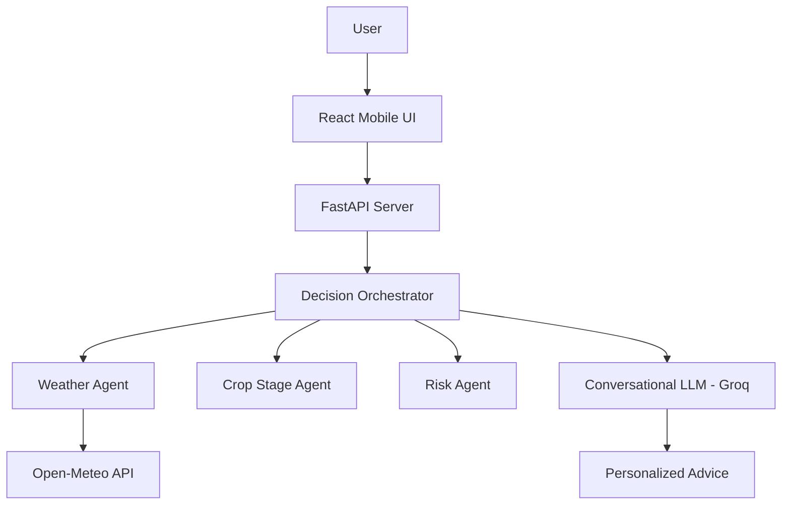

# 🌾 Digital Dilemma: Agricultural Decision Support System

A production-grade, multi-agent AI system that provides context-aware, data-backed farming advice through a conversational, human-centric interface. Available in multiple regional languages.


---

## ✨ Key Features

- **🧠 Multi-Agent Orchestration**: 6 specialized agents working in sync:
  - **Weather Agent**: Real-time localized weather via Open-Meteo.
  - **Crop Stage Agent**: GDD-based growth tracking and stage prediction.
  - **Risk Agent**: Intelligent threat detection (pest, disease, heat stress).
  - **Context Agent**: Memory and profile-aware advisory.
  - **Conversational Expert**: Refined AI persona that talks like a human, not a robot.
  - **Decision Orchestrator**: Rule-based logic ensures the AI never hallucinates advice.

- **💬 Conversational Interface**: Person-to-person chat style with emoji-rich, concise, and helpful responses 🎙️.
- **🌍 Multi-Lingual Support**: Seamlessly switch between English, Hindi, Marathi, and more.
- **☁️ Cloud LLM (Groq)**: Blazing fast responses using Groq's Llama 3 infrastructure.
- **📱 Mobile-First Design**: Modern, glassmorphic UI built for the farmer's field.

---

## 🛠️ Tech Stack

- **Frontend**: React 18, Vite, TailwindCSS, Lucide Icons, i18next.
- **Backend**: FastAPI (Python), SQLAlchemy (Async), Pydantic v2.
- **Database**: SQLite (Async) for edge-ready performance.
- **LLM**: Groq API (Primary) / Ollama (Local Fallback).
- **APIs**: Open-Meteo (Weather), Custom GDD Algorithms.

---

## 🚀 Getting Started

### 1. Backend Setup

```bash
cd backend

# Create & activate virtual environment
python -m venv venv
source venv/bin/activate  # Windows: venv\Scripts\activate

# Install dependencies
pip install -r requirements.txt

# Configure Environment
cp .env.example .env
# Update .env with your GROQ_API_KEY
```

### 2. Frontend Setup

```bash
cd frontend

# Install dependencies
npm install

# Start development server
npm run dev
```

### 3. Run the App
- **Backend**: `uvicorn app.main:app --reload --port 8000`
- **Frontend**: Open `http://localhost:5174` (or the port Vite provides)

---

## 🏗️ System Architecture



---

## 📁 Project Structure

```text
Dilema-Agriculture/
├── backend/
│   ├── app/
│   │   ├── agents.py         # Multi-agent logic
│   │   ├── llm_service.py    # Groq/Ollama integration
│   │   ├── models.py         # DB & Pydantic models
│   │   └── routers/          # Auth, Profile, Chat endpoints
│   └── .env                  # Configuration
├── frontend/
│   ├── src/
│   │   ├── pages/            # Dashboard, Chat, Profile
│   │   ├── components/       # Layouts & Nav
│   │   └── services/         # Axios API clients
│   └── package.json
└── references/               # Legacy files and design docs
```

---

## 📸 Screenshots


---

## 📄 License & Credits

Distributed under the MIT License. Built with ❤️ for the global farming community.
